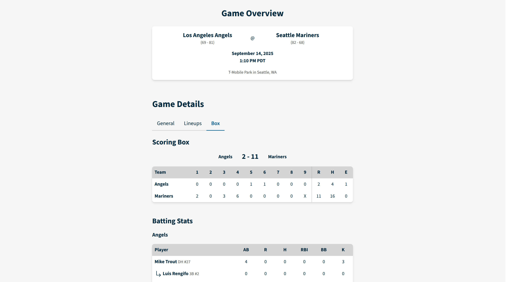

# The Ballpark Brief

A simple baseball stats tracker to help fans fill out their scorecards all in one place.


## Demo

View the live app: https://the-ballpark-brief.vercel.app/



## Features

- Explore MLB game schedules (today and past games)
- View starting lineups for each team
- Displays real-time starting pitcher stats (ERA, W-L, strikeouts)
- Automatic data refresh with polling at regular intervals
- Compare batting and pitching stats for individual players
- Responsive layout with scrollable tables for small screens
- Clean, minimal UI

## Tech Stack

- [Next.js (App Router)](https://nextjs.org/)
- [React](https://react.dev/)
- [TypeScript](https://www.typescriptlang.org/)
- [Tailwind CSS](https://tailwindcss.com/)
- [Headless UI](https://headlessui.com/)
- MLB Stats API (unofficial)

## Getting Started

### Prerequisites

- [Node.js](https://nodejs.org/) v18.18+
- npm v9+

### Installation

```bash
git clone https://github.com/your-username/the-ballpark-brief.git

cd the-ballpark-brief

npm install
```

#### Running Locally

```bash
npm run dev
```

#### Build for Production

```bash
npm run build

npm start
```

#### Environment Variables

This app uses the public MLB Stats API, so **no API key is required**.

## Future Improvements

- Live inning indicator
- Extra game details
- Expanded player stats
- Dark mode toggle

## License

This project is licensed under the MIT License.

## Disclaimer

This project uses the unofficial MLB Stats API for educational and personal use. This project is not affiliated with or endorsed by Major League Baseball (MLB). All team names, logos, and player images are property of MLB and their respective owners.
